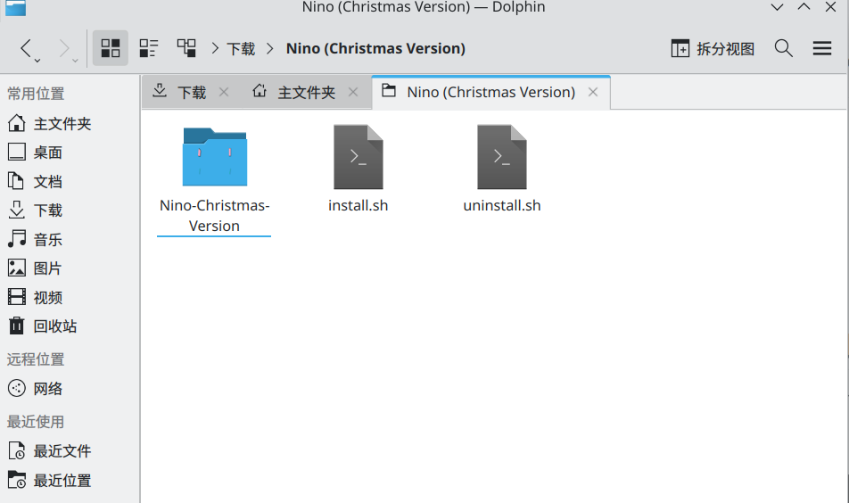

# ArchLinux使用Grub

## 1.下载
grub主题下载

[grub主页](https://www.pling.com)

[二次元](https://www.pling.com/p/1526503/)

## 2.解压并且复制
下载解压后,在目录下打开终端

执行命令
```bash
sudo cp -r . /usr/share/grub/themes/Nino && cd /usr/share/grub/themes/Nino
sudo ./install.sh
```
ArchLinux
```
sudo grub-mkconfig -o /boot/grub/grub.cfg      #更新Grub
```
重启即可